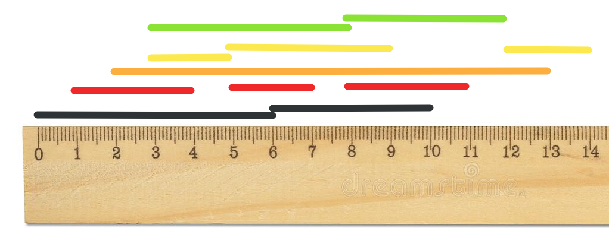

O particionamento de intervalo é um algoritmo de agendamento usado para atribuir tarefas a recursos de forma que os intervalos sobrepostos sejam minimizados. Aqui está um exemplo de implementação do algoritmo de particionamento de intervalo em Python:

**Dificuldade: Médio**

Entrada:
 [(1, 3), (2, 4), (5, 7), (6, 8), (9, 10)]

Saida:
Recurso 1: [(0, 6), (6, 10)]
Recurso 2: [(1, 4), (5, 7), (8, 11)]
Recurso 3: [(2, 13)]
Recurso 4: [(3, 5), (5, 9), (12, 14)]
Recurso 5: [(3, 8), (8, 12)]

